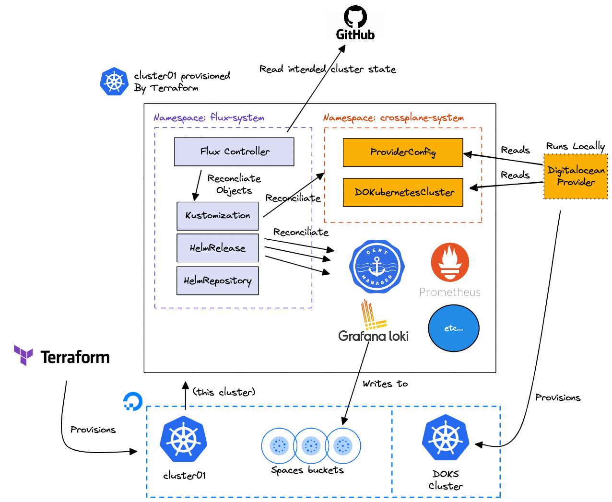
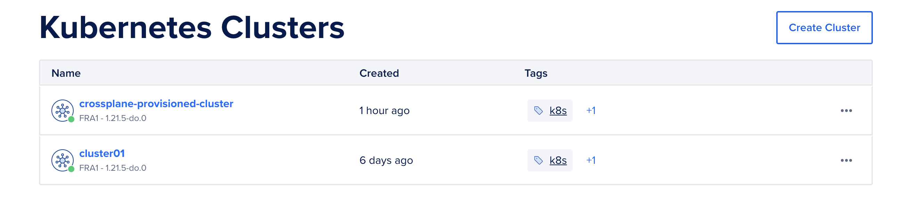

# DigitalOcean Kubernetes Challenge - Crossplane

This repository was created as a part of completing the Digital Ocean
[Kubernetes Challenge](https://www.digitalocean.com/community/pages/kubernetes-challenge).

All Flux-configuration made in the guide below can be found in a separate
[danquah/dco-k8s-challenge2021-flux](https://github.com/danquah/dco-k8s-challenge2021-flux)
repository.

## Main and secondary goals

I've chosen the Crossplane challenge, the description simply reads

 > Install Crossplane, which is like Terraform but you manage the infra from
 > inside Kubernetes, not from outside. Crossplane is an open source Kubernetes
 > add-on that enables platform teams to assemble infrastructure from multiple
 > vendors, and expose higher level self-service APIs for application teams to
 > consume, without having to write any code.

As as secondary goals I also want to

* Provision infrastructure as much as possible with [Terraform](https://www.terraform.io/)
* Handle the various deployments in the cluster via [Flux](https://fluxcd.io/)
* Install something that could potentially be a fully production ready setup.

## Approach

We will need a functional Kubernetes cluster in order to install and use Crossplane.
To keep to the sub-goal of setting things up "for real" I've chosen to follow
[Chapter 15 of Kubernetes-Starter-Kit-Developers](https://github.com/digitalocean/Kubernetes-Starter-Kit-Developers/tree/main/15-automate-with-terraform-flux)
which sets up a fully production-ready cluster and even uses Flux.

With the cluster up and running, we'll configure Crossplane, and provision
yet another cluster. You can't have to many clusters.

## Overview

The following diagram gives an overview of what we're deploying with a focus on
the Crossplane parts. I've internationally left out some of the pieces from the
Starter Kit such as the administration of the Terraform state.


## Installing the Kubernetes Starter Kit

This is more or less just a question of following [Chapter 15 of Kubernetes-Starter-Kit-Developers](https://github.com/digitalocean/Kubernetes-Starter-Kit-Developers/tree/main/15-automate-with-terraform-flux)
with a couple of modifications.

I've documented the places I deviate below:

1. Setup the required [prerequisites](https://github.com/digitalocean/Kubernetes-Starter-Kit-Developers/tree/main/15-automate-with-terraform-flux#prerequisites),
   with the following tweaks
   1. Don't create the Flux CD repo, we'll do that with Terraform
   2. Add the various tokens and keys the guide instruction to create to
      `credentials.env` (use `dist-credentials.env` as a template).
   3. Only create the space for the terraform state, all other (Loki, Velero)
      are created via Terraform.
2. do a `source credentials.env` before using Terraform.
3. Go through the guide - take extra care in the following steps
   1. When provisioning Loki, remember to edit the `HelmRelease` and insert the
      endpoints and keys for the aws `storage_config`. Use the spaces key/secret
      from `init.env` and get the bucket name and endpoint from `terraform output`
   2. Same goes for the Velero installation

## Installing Crossplane, take I

Next we set up Crossplane. We follow the pattern established by the starter kit:

* Use Helm chart/releases
* Install the release via Flux

We'll be using the [official Helm Chart](https://artifacthub.io/packages/helm/crossplane/crossplane):

Add a `crossplane.yaml` file under `clusters/cluster01/repositories` in the
flux github repo with the following contents:

```yaml
---
apiVersion: source.toolkit.fluxcd.io/v1beta1
kind: HelmRepository
metadata:
  name: crossplane-stable
  namespace: flux-system
spec:
  interval: 10m0s
  url: https://charts.crossplane.io/stable
```

Then add a `crossplane-v1.5.1.yaml` file under `clusters/cluster01/releases`
with the following contents:

```yaml
---
apiVersion: helm.toolkit.fluxcd.io/v2beta1
kind: HelmRelease
metadata:
  name: crossplane
  namespace: flux-system
spec:
  chart:
    spec:
      chart: crossplane
      sourceRef:
        kind: HelmRepository
        name: crossplane
      version: 1.5.1
  install:
    createNamespace: true
    remediation:
      retries: 3
  upgrade:
    remediation:
      retries: 3
  releaseName: crossplane
  targetNamespace: crossplane-system
  interval: 1m0s
```

Wait for crossplane to be up and running, you can verify this by running

```shell
$ flux get kustomization

NAME       READY MESSAGE                          REVISION SUSPENDED
crossplane True  Release reconciliation succeeded 1.5.1    False
```

With this in place we can install a provider into the cluster and start
provisioning resources.

This is where we reach some difficulties. Normally we would just tell Crossplane
to enable the Digitalocean provider, and then start configurering it. But the
provider is still a work in progress, and as such does not have an official
release that Crossplane can download and enable.

So, instead we'll have to follow some somewhat more manual steps.

## Installing Crossplane, take II (DO provider)

Prerequisites:

* A functional Go environment
* A clone of [crossplane-contrib/provider-digitalocean](https://github.com/crossplane-contrib/provider-digitalocean)
* A token for a Digitalocean account.

A crossplane provider needs 4 things.

1. A running instance of the controller
2. A set of Custom Resource Definitions installed into the cluster so that
   infrastructure can be described and the provider configured.
3. A ProviderConfig that holds the credentials the Provider should use to
   provision resource.
4. Any number of Custom Resources that describes the resources that should be
   provisioned.

Had we had a real release of the Provider, installing it would have taken care
of the first two steps. Instead we'll have to do this by hand:

First clone the current work-in-progress provider and verify you can build it.

```shell
git clone https://github.com/crossplane-contrib/provider-digitalocean.git
cd provider-digitalocean
go build cmd/provider/main.go
```

Then apply the provider CRDs manually to the cluster - we could do this via
Flux, but as this would normally be handled by Crossplane we'll do this part by
hand.

```shell
# While still inside the clone of provider-digitalocean.git:
kubectl apply -f ./package/crds/
```

Now that we have the CRDs in place, we can setup the ´Provider` and `ProviderConfig`
via Flux just as we would have if the provider was GA. We place these manifests
in a folder separate from the "system" manifests as we want to be able to declare
dependencies. This does not really matter as long as we're applying the CRDs by
hand, but we may as well do a proper setup.

```yaml
# ./clusters/cluster01-apps/crossplane-do-provider/provider.yaml
---
apiVersion: pkg.crossplane.io/v1
kind: Provider
metadata:
  name: provider-digitalocean
spec:
  package: "crossplane/provider-digitalocean:master"

# ./clusters/cluster01-apps/crossplane-do-provider-config/provider-config.yaml
---
apiVersion: do.crossplane.io/v1alpha1
kind: ProviderConfig
metadata:
  name: do-k8s-challenge-2021
spec:
  credentials:
    source: Secret
    secretRef:
      namespace: crossplane-system
      name: digital-ocean-token
      key: token

```

Then prepare a sealed secret with a Digitalocean token for the provider.

```shell
# We use the same pattern as to one established in the Kubernetes Starter Kit
SEALED_SECRETS_PUB_KEY="<YOUR_SEALED_SECRETS_PUB_KEY_NAME_HERE>"
DIGITALOCEAN_TOKEN="<YOUR_DIGITAL_OCEAN_TOKEN_HERE>"
kubectl create secret generic "digital-ocean-token" \
    --namespace crossplane-system \
    --from-literal=token="${DIGITALOCEAN_TOKEN}" \
    --dry-run=client -o yaml | kubeseal --cert="${SEALED_SECRETS_PUB_KEY}" \
    --format=yaml > ./clusters/cluster01-apps/crossplane-do-provider-config/digital-ocean-token-sealed.yaml
```

And finally tell Flux to pick up the Kustomizations

```shell
flux create kustomization crossplane-do-provider \
  --source=flux-system \
  --path="./clusters/cluster01-apps/crossplane-do-provider" \
  --prune=true \
  --interval=1m \
  --export > ./clusters/cluster01/kustomizations/do-provider.yaml

flux create kustomization crossplane-do-provider-config \
  --source=flux-system \
  --path="./clusters/cluster01-apps/crossplane-do-provider-config" \
  --prune=true \
  --interval=1m \
  --depends-on=crossplane-do-provider \
  --target-namespace=crossplane-system \
  --export > ./clusters/cluster01/kustomizations/do-provider-config.yaml
```

Add all of these files to git, push it, an cross your fingers :)

```shell
git add clusters/cluster01-apps/crossplane-do-provider/provider.yaml
git add clusters/cluster01-apps/crossplane-do-provider-config/digital-ocean-token-sealed.yaml
git add clusters/cluster01-apps/crossplane-do-provider-config/provider-config.yaml
git add clusters/cluster01/kustomizations/do-provider.yaml
git add clusters/cluster01/kustomizations/do-provider-config.yaml

git commit -m "Add Crossplane Provider configuration"
git push origin
```

After some time, flux should report that the two Kustomizations we've set up
has been reconciled:

```shell
flux get kustomizations
```

All kustomizations should report `Ready = true`

## Using Crossplane

Then with everything working, launch the provider

```shell
# From inside the clone of provider-digitalocean.git:
go run cmd/provider/main.go --debug
```

When the provider running, we can finally provision some resources. Lets provision
 a cluster:

First we setup a Kustomization we'll be using for all of our resources.

```shell
flux create kustomization crossplane-resources \
  --source=flux-system \
  --path="./clusters/cluster01-apps/crossplane-resources" \
  --prune=true \
  --interval=1m \
  --depends-on=crossplane-do-provider-config \
  --target-namespace=crossplane-resources \
  --export > ./clusters/cluster01/kustomizations/crossplane-resource.yaml
```

Then add the manifest that describes the cluster.

```yaml
# ./clusters/cluster01-apps/crossplane-resources/doks.yaml
---
apiVersion: kubernetes.do.crossplane.io/v1alpha1
kind: DOKubernetesCluster
metadata:
  name: crossplane-provisioned-cluster
spec:
  providerConfigRef:
    name: crossplane-do-provider-config
  forProvider:
    region: fra1
    version: 1.21.5-do.0
    nodePools:
      - size: s-1vcpu-2gb
        count: 1
        name: worker-pool
    maintenancePolicy:
      startTime: "00:00"
      day: wednesday
    autoUpgrade: true
    surgeUpgrade: false
    highlyAvailable: false
```

And commit and push the diff

```shell
git add clusters/cluster01/kustomizations/crossplane-resource.yaml
git add clusters/cluster01-apps/crossplane-resources/doks.yaml

git commit -m "Provision resources via Crossplane"
git push origin
```

After a while the `DOKubernetesCluster` should be created, and the Provider
running locally should pick up the object and start provisioning the cluster.

After a while, you should hopefully have a reconciled object:

```shell
$ kubectl -n crossplane-resources get DOKubernetesCluster
NAME                             READY   SYNCED
crossplane-provisioned-cluster           True

$ kubectl -n crossplane-resources describe DOKubernetesCluster crossplane-provisioned-cluster
... (lots of output) ...
Status:
  At Provider:
    Auto Upgrade:    true
    Cluster Subnet:  10.244.0.0/16
    Created At:      2021-12-25 08:48:09 +0000 UTC
    Endpoint:        https://d861de8d-a0d3-46e2-88fc-dfa8460f1a40.k8s.ondigitalocean.com
    Id:              d861de8d-a0d3-46e2-88fc-dfa8460f1a40
    ipv4:            139.59.147.14
    Maintenance Policy:
      Duration:  4h0m0s
    Name:        crossplane-provisioned-cluster
    Node Pools:
      Count:  1
      Id:     5d9d08b8-92c6-4745-b819-e56980e78d39
      Name:   worker-pool
      Nodes:
        Created At:  2021-12-25 08:48:09 +0000 UTC
        Droplet ID:  279305197
        Id:          1d67e197-2410-4dba-92ef-5f3952fe7125
        Name:        worker-pool-ua0v1
        Status:
          State:     running
        Updated At:  2021-12-25 08:51:45 +0000 UTC
      Size:          s-1vcpu-2gb
      Tags:
        k8s
        k8s:d861de8d-a0d3-46e2-88fc-dfa8460f1a40
        k8s:worker
    Region:          fra1
    Service Subnet:  10.245.0.0/16
    Status:
      State:  running
    Tags:
      k8s
      k8s:d861de8d-a0d3-46e2-88fc-dfa8460f1a40
    Updated At:  2021-12-25 08:55:05 +0000 UTC
    Version:     1.21.5-do.0
    Vpcuuid:     6cbf90a1-ec87-45cf-b33e-f974cd4ecb06
  Conditions:
    Last Transition Time:  2021-12-25T08:48:09Z
    Reason:                ReconcileSuccess
    Status:                True
    Type:                  Synced
```

Also, taking a look at the DO console we should now have two clusters:



## Evaluation

All in all the everything worked out. There are a number of areas that could be
improved, in particular if this setup is to be used for a real production setup:

1. All credentials are currently kept in the developers checkout of the repository.
   These credentials should be placed somewhere safe that could be accessed by
   other team-members. Digital Ocean does not have a key vault/key store product.
   An alternative would be to check encrypted credentials in to the GitHub repo,
   or adding all credentials as secrets to the cluster and run them via actions.
   There are plenty of products to choose between.
2. I could have used separate spaces access/secret keys for everything, but to
  keep everything simple I've opted for just reusing the same key. Should one wish
  to use this setup for real, separate keys should be introduced. The same key is
  currently used by

    * By Terraform to access it's state
    * By Terraform to create buckets for Loki and Velero
    * By Loki and Velero to write their data

3. Would have been nice with a fully functional Digitalocean Crossplane provider,
but even in it's current state it worked just fine for getting some real-life
experience with working with it. When it's ready at some point, it should just
be question of skipping the manual steps in the guide.
